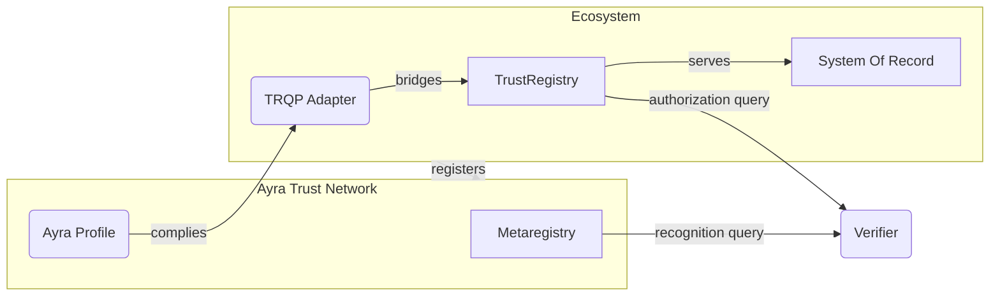
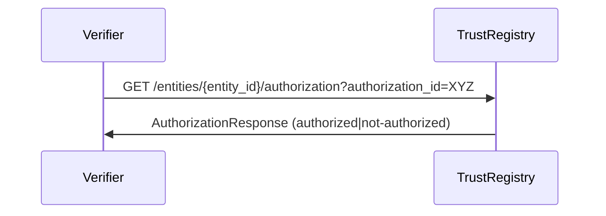
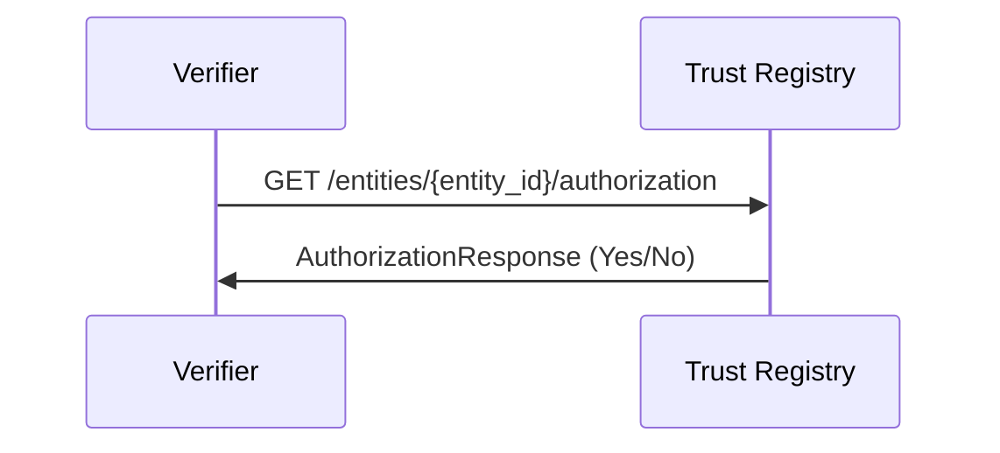
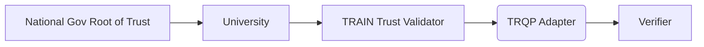

# Ayra TRQP Implementers Guide

**State: DRAFT**

This document is a *non-normative* guide to help you implement the Trust Registry Query Protocol (TRQP) for participation in the Ayra Trust Network (ATN). It is intended as a starting point for understanding how to achieve trusted, cross-ecosystem data exchange using TRQP. By following this guide, you will learn the fundamentals of bridging your existing trust frameworks via a standardized interface.


## Important Pre-Reads

Before diving into implementation details, we recommend familiarizing yourself with:

- Ayra TRQP Implementation Profile  
- Introduction to Ayra  
- Ayra Technical Whitepaper  

(These references provide deeper background on the Ayra ecosystem and the TRQP specifications.)

## TRQP Basics: Bridging Your Ecosystem

### Overview

The Trust Registry Query Protocol (TRQP) is *not* intended to replace an existing *intra-trust* framework (such as OpenID Federation, X.509 PKI, EBSI Trust Chains, TRAIN, etc.). Rather, it acts as a **bridge** across frameworks, answering critical questions about **who** is authorized to do **what** under a particular governance framework.

TRQP defines two main authority queries:

1. **Recognition Query**  
2. **Authorization Query**  

The Authorization Query is the key mechanism for answering questions like:

> “Does Entity X have Authorization Y, in the context of Ecosystem Governance Framework Z?”

For example, “Is issuer X authorized to issue credential Y under ecosystem Z?”  
We often call this the “triples model”: (Entity X, Authorization Y, Ecosystem Governance Framework Z).

Within the Ayra Trust Network, conforming to the Authorization Query is a **minimum requirement** to participate. Any **verifier** wanting to connect must be able to perform both a **Recognition Query** (to check if an ecosystem is recognized by ATN) and an **Authorization Query** (to confirm an entity’s authorization within that ecosystem).

When bridging into an ecosystem, you may need adapters tailored to that ecosystem’s internal trust framework. The diagram below shows a simplified conceptual flow:




You can develop or reuse any *internal* trust model you prefer. The only requirement is that you expose the necessary TRQP endpoints so that external verifiers can query your trust state.

#### Four Key Takeaways

1. **TRQP** does *not* replace your intra-ecosystem trust framework. It **complements** it.  
2. **TRQP** is a bridge across various frameworks and is agnostic to specific internal trust methods.  
3. You must handle how to map your *internal* trust model to **TRQP**.  
4. **TRQP** ultimately answers: “Does Entity X have Authorization Y, in the context of Ecosystem Governance Framework Z?”

---

## Core Requirements of Implementing the TRQP for the Ayra Trust Network

To be a compatible Trust Registry for Ayra, your registry must:

- Handle queries for the Authorization Query (for example, `GET /entities/{entity_id}/authorization`).
- Return a compliant **Authorization Response**.

This means your ecosystem **must** track and provide the state of who is authorized to do what, *and* publish that data via a TRQP-enabled endpoint.



### Two Key Takeaways

1. A **Trust Registry** must internally represent the **authorization state** of the ecosystem.  
2. **TRQP** provides a base technical interoperability layer (transport, data models, identifiers). You, as the ecosystem implementer, are responsible for your internal logic.

---

## Registering Your Ecosystem with Ayra

Joining the Ayra Trust Network involves:

1. Providing a valid **DID** for your ecosystem.  
2. Completing the **Ayra Trust Network governance process** (review, approval, etc.).

### Creating an Identifier for Your Registry

1. **Prepare Your Trust Registry Keys**  
   You need cryptographic keys for your Trust Registry’s DID.  

2. **Create Your Trust Registry DID**  
   Choose a DID method (as allowed by the Ayra TRQP Implementation Profile) and generate a DID.  

   Your registry’s DID **must** include at least one **service endpoint** referencing a TRQP profile, such as `https://ayra.forum/profiles/trqp/tr/v1` (or equivalent).  

3. (Optional) **Tools**  
   Some ecosystems may have tooling for DID creation. Make sure at least one of your DID’s service endpoints points to the TRQP service for your registry.

### Creating an Identifier for Your Ecosystem

1. **Prepare Ecosystem Keys**  
   Generate cryptographic keys for your ecosystem’s DID.  

2. **Generate Your Ecosystem DID**  
   The ecosystem DID **must** have at least two service endpoints:

   - One pointing to the Ecosystem Governance Framework documentation.  
   - One pointing to the DID of the Trust Registry.  

3. **Provide Your Ecosystem’s DID to Ayra**  
   Complete the governance review and register your ecosystem’s DID with Ayra.

---

## Performing Authority Queries as a Verifier

Below is a step-by-step process for how a verifier would make TRQP queries.

### Resolving a Recognition Query Against the Ayra Trust Network

1. **Resolve Ayra’s DID**  
   Retrieve Ayra’s DID document to find its TRQP endpoints.

2. **Query the Ayra Trust Network for Recognition**  
   Call something like:  
   ```
   GET /registries/{ecosystem_did}/recognition?egf_did=<ayra_egf_did>
   ```
   If `{ecosystem_did}` is recognized, the response indicates `recognized: true`.

### Resolving an Authorization Query Against an Ecosystem

1. **Resolve the Ecosystem’s DID**  
   Extract the relevant TRQP endpoint from the ecosystem DID.

2. **Query the Ecosystem’s Trust Registry**  
   Call:  
   ```
   GET /entities/{entity_id}/authorization?authorization_id=...&ecosystem_did=...
   ```
   This returns whether `{entity_id}` is authorized under `authorization_id` for that particular ecosystem.

---

## Standard Interaction Patterns

### Simple Pattern

In the simplest scenario, there is just one trust registry. The verifier queries `GET /entities/{entity_id}/authorization` to check if the entity holds the desired authorization. The flow is direct and shallow.



### Bridge Case Study: TRAIN

In a more complex scenario (for example, using EBSI Trust Chains or TRAIN), an ecosystem might have intricate internal logic involving national-level roots of trust, multi-level issuance, etc. By **wrapping** your internal trust validators with TRQP endpoints, you can expose a simple “authorization” yes/no to external verifiers.

For example:



After registering your DID with Ayra and passing governance, verifiers can call your TRQP service for a straightforward answer, abstracting away the internal complexities.

---

## Security Considerations

- **Trust Anchor Hijacking**: Attackers spoof or manipulate registry data.  
- **DNS Hijacking**: If domain-based endpoints are used, DNS spoofing can misdirect queries.  
- **Replay Attacks**: Reusing valid requests or responses to gain unauthorized access.  
- **Data Integrity**: Use cryptographic signatures or JWS to ensure integrity.  
- **Denial of Service**: Rate limiting, caching, or load balancing may be necessary.  
- **Insufficient Data Validation**: Input validation is crucial.  
- **Logging and Auditing**: Keep detailed records for attack detection.  
- **Protocol Downgrade Attacks**: Always default to the latest and most secure approach.  
- **Privacy Concerns**: Limit personal data in requests and responses.  
- **Timing Attacks**: Consider side-channel protections in your server logic.

### Key Security Takeaways

- Manage cryptographic keys securely.  
- Provide robust, signed responses (for example, JWS).  
- Retain thorough logs.  
- Align with best practices for data validation and availability.

---

## Q&A

### Ecosystem Governance Framework. What Does It Mean Practically?

An Ecosystem Governance Framework (EGF) is the overarching governance model for a digital trust ecosystem. It can incorporate policies, credential rules, or references to other frameworks. Often it’s simply documentation or a specification describing how the ecosystem operates.

### How Should I Think About Authorizations?

An authorization is a formal grant of privileges. TRQP only needs an **authorization identifier**; the internal meaning or structure of that authorization is up to you. Verifiers ask: “Does entity X hold authorization Y?” and you respond accordingly.

### What Types of Entries Can I Support?

TRQP is not prescriptive about your internal model. As long as you can map `(entity_id, authorization_id, ecosystem_did)` to a yes/no authorization state, you can use TRQP.

### What’s the Difference Between Recognition and Authorization?

- **Recognition** is stating that you accept or acknowledge some other ecosystem or entity.  
- **Authorization** is a formal, hierarchical grant of privileges to an entity within an ecosystem.

### Does This Work Offline?

You *can* cache data, but it may become stale. Whether you allow offline checks depends on your ecosystem’s tolerance for stale information.

### What About Phone Home?

Current TRQP profiles are **RESTful**. This could involve real-time calls (“phoning home”) to the registry. Future patterns might explore more decentralized or offline-friendly approaches.

### Is a Query to the Ayra Trust Network Private?

Typically, only DIDs and query parameters are involved—no direct personally identifiable information. However, correlation risks (like IP-level monitoring) still exist.

### What About Correlation Risk?

The minimal data in queries (DIDs) helps reduce correlation, but it does not eliminate it completely (especially if combined with network metadata).

### How Does This Fit With Regulatory Requirements?

Local ecosystems must ensure compliance with regulatory obligations. Ayra’s governance process also involves some level of regulatory and policy alignment at the network level.

---

## Ayra Extensions

The Ayra Trust Network defines additional endpoints and functionalities on top of core TRQP. These endpoints let participants query or discover ecosystem-specific data beyond basic authorization and recognition:

1. **Listing Recognized Ecosystems**  
   - `GET /ecosystems/{ecosystem_did}/recognitions`  
   - Returns a list of ecosystem objects recognized under a particular EGF.  

2. **Looking Up Assurance Levels**  
   - `GET /ecosystems/{ecosystem_did}/lookups/assuranceLevels`  
   - Provides the set of assurance levels (e.g., LoA2, LoA3, etc.) recognized in a given ecosystem.  

3. **Looking Up Authorizations**  
   - `GET /ecosystems/{ecosystem_did}/lookups/authorizations`  
   - Retrieves details about all authorizations within a specific ecosystem, if the registry chooses to expose them.  

4. **Looking Up Supported DID Methods**  
   - `GET /egfs/{ecosystem_did}/lookups/didmethods`  
   - Returns DID methods that are valid within the specified governance framework.  

These extension endpoints are optional but recommended, as they facilitate richer interoperability and better self-service discovery for verifiers and other ecosystem participants.

---

## OpenAPI (TRQP) Specification

Below is an **OpenAPI 3.0** specification reference showing the RESTful endpoints and data models required for Ayra TRQP. You can use this as a starting point or merge it into your existing infrastructure. All hyperlinks have been removed for brevity.

<details>
<summary>Click to View the OpenAPI 3.0 Specification</summary>

```yaml
openapi: 3.0.1
info:
  title: Ayra TRQP Profile API
  version: 1.0.0
  description: >
    This specification defines a RESTful TRQP profile for use in the Ayra Trust Network.
    It includes endpoints for retrieving Trust Registry metadata,
    authorization data, verifying entity authorization status,
    and checking ecosystem recognition.

servers:
  - url: https://example-trust-registry.com
    description: Production server (example)
  - url: https://sandbox-trust-registry.com
    description: Sandbox server (example)

tags:
  - name: trqp
    description: TRQP Compliant Queries
  - name: extensions
    description: Ayra Extensions to TRQP

paths:
  /metadata:
    get:
      summary: Retrieve Trust Registry Metadata
      tags:
        - trqp
      description: Returns Trust Registry Metadata as a JSON object.
      operationId: getTrustRegistryMetadata
      parameters:
        - name: egf_did
          in: query
          required: false
          description: >
            An optional identifier specifying which ecosystem's
            metadata should be retrieved.
          schema:
            type: string
      responses:
        '200':
          description: Successfully retrieved Trust Registry Metadata.
          content:
            application/json:
              schema:
                $ref: '#/components/schemas/TrustRegistryMetadata'
        '404':
          description: Metadata not found.
          content:
            application/json:
              schema:
                $ref: '#/components/schemas/ProblemDetails'
        '401':
          description: Unauthorized request.
          content:
            application/json:
              schema:
                $ref: '#/components/schemas/ProblemDetails'

  /entities/{entity_id}:
    get:
      summary: Retrieve Entity Information
      tags:
        - extensions
      description: Retrieves information about a specific entity.
      operationId: getEntityInformation
      parameters:
        - name: entity_id
          in: path
          required: true
          description: A unique identifier for the entity.
          schema:
            type: string
      responses:
        '200':
          description: Entity information successfully retrieved.
          content:
            application/json:
              schema:
                type: object
                description: A JSON object containing entity information.
        '404':
          description: Entity not found.
          content:
            application/json:
              schema:
                $ref: '#/components/schemas/ProblemDetails'
        '401':
          description: Unauthorized request.
          content:
            application/json:
              schema:
                $ref: '#/components/schemas/ProblemDetails'

  /entities/{entity_id}/authorization:
    get:
      summary: Check Entity Authorization Status
      tags:
        - trqp
      description: >
        Determines if the specified entity (entity_id) is authorized
        under the given authorization identifier (authorization_id)
        within the specified governance framework (ecosystem_did).
        Optionally, returns a list of authorizations if all is true.
      operationId: checkAuthorizationStatus
      parameters:
        - name: entity_id
          in: path
          required: true
          description: Unique identifier of the entity.
          schema:
            type: string
        - name: authorization_id
          in: query
          required: true
          description: Authorization identifier to evaluate.
          schema:
            type: string
        - name: ecosystem_did
          in: query
          required: true
          description: Unique identifier of the governance framework.
          schema:
            type: string
        - name: all
          in: query
          required: true
          description: Whether to return a list of authorizations.
          schema:
            type: boolean
        - name: time
          in: query
          required: false
          description: >
            ISO8601/RFC3339 timestamp for authorization status
            evaluation. Defaults to the current time if omitted.
          schema:
            type: string
            format: date-time
      responses:
        '200':
          description: Authorization status successfully retrieved.
          content:
            application/json:
              schema:
                oneOf:
                  - $ref: '#/components/schemas/AuthorizationResponse'
                  - type: array
                    items:
                      $ref: '#/components/schemas/AuthorizationResponse'
        '404':
          description: Entity not found.
          content:
            application/json:
              schema:
                $ref: '#/components/schemas/ProblemDetails'
        '401':
          description: Unauthorized request.
          content:
            application/json:
              schema:
                $ref: '#/components/schemas/ProblemDetails'

  /registries/{ecosystem_did}/recognition:
    get:
      summary: Check Ecosystem Recognition
      tags:
        - trqp
      description: >
        Verifies if the specified ecosystem (egf_target) is recognized
        under the given governance framework (egf_source).
      operationId: checkEcosystemRecognition
      parameters:
        - name: ecosystem_did
          in: path
          required: true
          description: Unique identifier of the ecosystem being queried.
          schema:
            type: string
        - name: egf_did
          in: query
          required: true
          description: >
            Unique identifier of the governance framework. Defaults to
            the trust registry’s own if none is supplied.
          schema:
            type: string
        - name: time
          in: query
          required: false
          description: >
            RFC3339 timestamp indicating when recognition is checked.
            Defaults to "now" on the system being queried.
          schema:
            type: string
            format: date-time
      responses:
        '200':
          description: Ecosystem recognition successfully verified.
          content:
            application/json:
              schema:
                $ref: '#/components/schemas/RecognitionResponse'
        '401':
          description: Unauthorized request.
          content:
            application/json:
              schema:
                $ref: '#/components/schemas/ProblemDetails'
        '404':
          description: Ecosystem not recognized or not found.
          content:
            application/json:
              schema:
                $ref: '#/components/schemas/ProblemDetails'

  /ecosystems/{ecosystem_did}/recognitions:
    get:
      summary: List Recognized Ecosystems
      tags:
        - extensions
      description: >
        Retrieves a collection of recognized ecosystems for a
        specified governance framework.
      operationId: listEcosystemRecognitions
      parameters:
        - name: ecosystem_did
          in: path
          required: true
          description: Unique identifier of the ecosystem being queried.
          schema:
            type: string
        - name: egf_did
          in: query
          required: false
          description: >
            Optional identifier of the governance framework to filter
            the response. 
          schema:
            type: string
        - name: time
          in: query
          required: false
          description: >
            RFC3339 timestamp indicating when recognition is checked.
          schema:
            type: string
            format: date-time
      responses:
        '200':
          description: Ecosystem recognitions retrieved successfully.
          content:
            application/json:
              schema:
                type: array
                items:
                  $ref: '#/components/schemas/RecognitionResponse'
        '401':
          description: Unauthorized request.
          content:
            application/json:
              schema:
                $ref: '#/components/schemas/ProblemDetails'
        '404':
          description: Ecosystem not recognized or not found.
          content:
            application/json:
              schema:
                $ref: '#/components/schemas/ProblemDetails'

  /ecosystems/{ecosystem_did}/lookups/assuranceLevels:
    get:
      summary: Lookup Supported Assurance Levels
      tags:
        - extensions
      description: >
        Retrieves the supported assurance levels for the specified
        ecosystem.
      operationId: lookupSupportedAssuranceLevels
      parameters:
        - name: ecosystem_did
          in: path
          required: true
          description: Unique identifier of the ecosystem being queried.
          schema:
            type: string
      responses:
        '200':
          description: Supported assurance levels retrieved successfully.
          content:
            application/json:
              schema:
                type: array
                items:
                  $ref: '#/components/schemas/AssuranceLevelResponse'
        '401':
          description: Unauthorized request.
          content:
            application/json:
              schema:
                $ref: '#/components/schemas/ProblemDetails'
        '404':
          description: Ecosystem not found.
          content:
            application/json:
              schema:
                $ref: '#/components/schemas/ProblemDetails'

  /ecosystems/{ecosystem_did}/lookups/authorizations:
    get:
      summary: Lookup Authorizations
      tags:
        - extensions
      description: >
        Performs an authorization lookup based on the provided
        ecosystem identifier.
      operationId: lookupAuthorizations
      parameters:
        - name: ecosystem_did
          in: path
          required: true
          description: Ecosystem identifier.
          schema:
            type: string
      responses:
        '200':
          description: A list of authorization responses.
          content:
            application/json:
              schema:
                type: array
                items:
                  $ref: '#/components/schemas/AuthorizationResponse'
        '404':
          description: Entity not found.
          content:
            application/json:
              schema:
                $ref: '#/components/schemas/ProblemDetails'
        '401':
          description: Unauthorized request.
          content:
            application/json:
              schema:
                $ref: '#/components/schemas/ProblemDetails'

  /egfs/{ecosystem_did}/lookups/didmethods:
    get:
      summary: Lookup Supported DID Methods
      tags:
        - extensions
      description: >
        Retrieves the supported DID Methods recognized by this trust
        registry for the specified ecosystem governance framework.
      operationId: lookupSupportedDIDMethods
      parameters:
        - name: ecosystem_did
          in: path
          required: true
          description: Unique identifier of the ecosystem being queried.
          schema:
            type: string
      responses:
        '200':
          description: Supported DID Methods retrieved successfully.
          content:
            application/json:
              schema:
                type: array
                items:
                  $ref: '#/components/schemas/DIDMethodListType'
        '401':
          description: Unauthorized request.
          content:
            application/json:
              schema:
                $ref: '#/components/schemas/ProblemDetails'
        '404':
          description: Ecosystem not found.
          content:
            application/json:
              schema:
                $ref: '#/components/schemas/ProblemDetails'

components:
  schemas:
    ProblemDetails:
      type: object
      description: >
        A Problem Details object (RFC 7807).
      properties:
        type:
          type: string
          format: uri
          description: URI reference identifying the problem type.
        title:
          type: string
          description: Short, human-readable summary of the problem.
        status:
          type: integer
          description: HTTP status code (e.g., 404).
        detail:
          type: string
          description: Human-readable explanation of the problem.
        instance:
          type: string
          format: uri
          description: URI reference identifying this specific occurrence.
      additionalProperties: true

    TrustRegistryMetadata:
      type: object
      properties:
        id:
          type: string
          description: Unique identifier of the Trust Registry.
        default_egf_did:
          type: string
          description: >
            Default EGF DID used if none is supplied in queries.
        description:
          type: string
          maxLength: 4096
          description: A description of the Trust Registry.
        name:
          type: string
          description: Human-readable name of the Trust Registry.
        controllers:
          type: array
          description: List of unique identifiers for controllers.
          items:
            type: string
          minItems: 1
      required:
        - id
        - description
        - name
        - controllers

    AuthorizationResponse:
      type: object
      properties:
        egf_did:
          type: string
          description: EGF DID this authorization response relates to.
        recognized:
          type: boolean
          description: Indicates if the entity is recognized by the TR.
        authorized:
          type: boolean
          description: Indicates if the entity holds the authorization.
        message:
          type: string
          description: Additional context for the authorization status.
        evaluated_at:
          type: string
          format: date-time
          description: Timestamp when the status was evaluated.
        response_time:
          type: string
          format: date-time
          description: Timestamp when the response was generated.
        expiry_time:
          type: string
          format: date-time
          description: Expiration timestamp (if any).
        jws:
          type: string
          description: Signed response (JWS) from the registry’s controller.
      required:
        - recognized
        - authorized
        - message
        - evaluated_at
        - response_time

    RecognitionResponse:
      type: object
      properties:
        recognized:
          type: boolean
          description: Indicates if the ecosystem is recognized.
        message:
          type: string
          description: Additional info about the recognition status.
        egf_did:
          type: string
          description: EGF DID this recognition applies to.
        evaluated_at:
          type: string
          format: date-time
          description: Timestamp when the status was evaluated.
        response_time:
          type: string
          format: date-time
          description: Timestamp when the response was generated.
        expiry_time:
          type: string
          format: date-time
          description: Expiration timestamp (if any).
        jws:
          type: string
          description: Signed response (JWS) from the registry’s controller.
      required:
        - recognized
        - message
        - evaluated_at
        - response_time

    AssuranceLevelResponse:
      type: object
      properties:
        egf_did:
          type: string
          description: EGF DID this assurance level applies to.
        assurance_level:
          type: string
          description: The assurance level (e.g. LOA2).
        description:
          type: string
          description: Details about the assurance level.
      required:
        - assurance_level
        - description

    DIDMethodType:
      type: object
      required:
        - identifier
      description: DID Method supported by the trust registry.
      properties:
        identifier:
          type: string
          description: Name or URI referencing the DID method.
        egf_did:
          type: string
          description: EGF DID that recognizes this DID method.
        maximumAssuranceLevel:
          $ref: "#/components/schemas/AssuranceLevelType"

    DIDMethodListType:
      type: array
      items:
        $ref: "#/components/schemas/DIDMethodType"

    AssuranceLevelType:
      type: object
      description: Defines a recognized assurance level in a trust registry.
      required:
        - identifier
        - name
        - description
      properties:
        identifier:
          type: string
          format: uri
        name:
          type: string
        description:
          type: string
```
</details>
