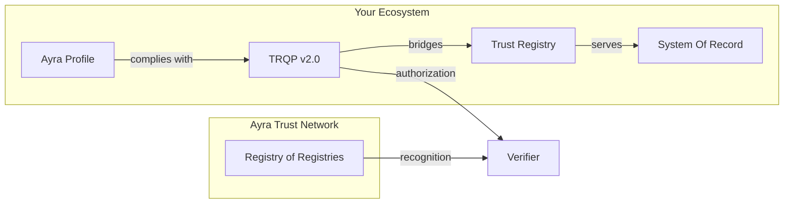
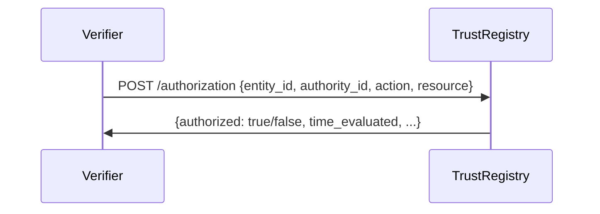
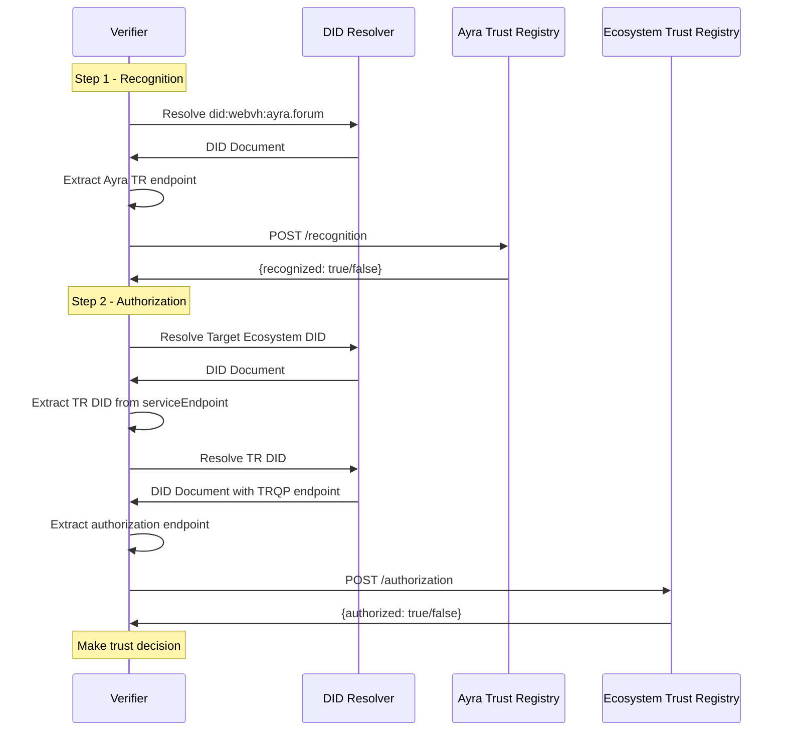

# Ayra TRQP Implementers Guide

**State: DRAFT**

::: note
See the [Profile](https://ayraforum.github.io/ayra-trust-registry-resources) for the Ayra TRQP Profile
:::

This document is a *non-normative* guide to help you implement the Trust Registry Query Protocol (TRQP) for participation in the Ayra Trust Network (ATN). It is intended as a starting point for understanding how to achieve trusted, cross-ecosystem data exchange using TRQP. By following this guide, you will learn the fundamentals of bridging your existing trust frameworks via a standardized interface.

## Important Pre-Reads

Before diving into implementation details, we recommend familiarizing yourself with:

- [Trust Registry Query Protocol (TRQP) v2.0 Specification](https://trustoverip.github.io/tswg-trust-registry-protocol/)
- [Ayra TRQP Profile](https://ayraforum.github.io/ayra-trust-registry-resources)
- [Introduction to Ayra](https://ayra.forum/ayra-introduction/)
- [Ayra Technical Whitepaper](https://ayra.forum/ayra-technical-whitepaper/)

## API Specifications

The canonical API specification for Ayra TRQP is maintained as a single OpenAPI file and can be browsed interactively:

- [Ayra TRQP Profile API](https://ayraforum.github.io/ayra-trust-registry-resources/api.html) -- TRQP v2.0 core endpoints (`trqp-core` tag) and Ayra extension endpoints (`ayra-extension` tag)

---

## TRQP Basics: Bridging Your Ecosystem

### Overview

The Trust Registry Query Protocol (TRQP) is *not* intended to replace an existing *intra-trust* framework (such as OpenID Federation, X.509 PKI, EBSI Trust Chains, TRAIN, etc.). Rather, it acts as a **bridge** across frameworks, answering critical questions about **who** is authorized to do **what** under a particular governance framework.

TRQP v2.0 uses the **PARC model** (Principal, Action, Resource, Context) for all queries:

| PARC Element | TRQP Field | Description |
| :---- | :---- | :---- |
| **Principal** | `entity_id` | The entity being tested (e.g. an issuer DID) |
| **Action** | `action` | What action is being checked (e.g. `issue`, `verify`) |
| **Resource** | `resource` | What the action applies to (e.g. `credential:driverlicense`) |
| **Context** | `authority_id` + `context` | The ecosystem being queried, plus optional parameters like `time` |

TRQP defines two main query types:

1. **Authorization Query** (`POST /authorization`) -- "Does Entity X have authorization to perform Action Y on Resource Z, according to Ecosystem W?"
2. **Recognition Query** (`POST /recognition`) -- "Does Ecosystem A recognize Ecosystem B for Action Y on Resource Z?"

Within the Ayra Trust Network, conforming to both queries is a **minimum requirement** to participate.

When bridging into an ecosystem, you may need adapters tailored to that ecosystem's internal trust framework. The diagram below shows the conceptual architecture:



You can develop or reuse any *internal* trust model you prefer. The only requirement is that you expose the necessary TRQP endpoints so that external verifiers can query your trust state.

### Key Participants

| Participant | Description |
| :---- | :---- |
| **TRQP API Provider** | Vendors that supply a Trust Registry Query Protocol (TRQP) service on behalf of an ecosystem. |
| **Ayra Metaregistry Operators** | The set of metaregistry operators that serve the Ayra Trust Network state by relaying recognized ecosystems. |
| **Verifier** | The end authority verifier that is interested in verifying not only the cryptography, but the validity of the author for the set of claims. |
| **Ecosystem** | Ecosystems leverage TR vendors to manage their authority state. Each ecosystem must have sovereignty over their authority state. |

### Key Takeaways

1. **TRQP complements** your systems of record, operational processes, and governance frameworks. It provides a simple, consistent way for external systems to query your system for only the answers you are willing to provide.
2. **TRQP is a bridge** across frameworks and is agnostic to specific internal trust methods.
3. You must handle how to **map your internal trust model** to TRQP's PARC query structure.
4. **TRQP answers two questions:**
   - Is this entity authorized? -- "Does Entity X have the right to perform Action Y on Resource Z, in the context of Ecosystem W?"
   - Do you recognize this other ecosystem? -- "Does Ecosystem A recognize Ecosystem B for Action Y on Resource Z?"

---

## Conformance Checklist

The following table maps TRQP v2.0 conformance requirements to what an Ayra implementer must provide. This is a summary; refer to the [TRQP v2.0 specification](https://trustoverip.github.io/tswg-trust-registry-protocol/) and [Ayra Profile](https://ayraforum.github.io/ayra-trust-registry-resources) for normative requirements.

| Requirement | TRQP v2.0 | Ayra Profile |
| :---- | :---- | :---- |
| **Query types** | MUST support at least one (authorization OR recognition) | MUST support BOTH `/authorization` AND `/recognition` |
| **HTTP method** | POST with JSON body | POST with JSON body |
| **Content-Type** | MUST be `application/json` | MUST be `application/json` |
| **Required query fields** | `entity_id`, `authority_id`, `action`, `resource` | Same |
| **Identifier format** | RFC 3986 URI strings | `did:webvh` required for ecosystems and trust registries |
| **DateTime format** | RFC 3339, Z offset only | RFC 3339, Z offset only |
| **Error format** | RFC 7807 Problem Details | RFC 7807 Problem Details |
| **HTTP status codes** | 200, 400, 401, 404, 500 | 200, 400, 401, 404, 500 |
| **Response signing** | Not required by TRQP core | MUST return JWS signed by the Trust Registry controller |
| **Metadata endpoint** | Not defined in TRQP core | RECOMMENDED: `GET /metadata` (Ayra extension) |
| **Lookup endpoints** | Not defined in TRQP core | RECOMMENDED: assurance levels, authorizations, DID methods (Ayra extensions) |
| **Ecosystem DID** | Not prescribed | MUST be `did:webvh` with at least two service endpoints |
| **Trust Registry DID** | Not prescribed | MUST be `did:webvh` with at least one service endpoint |

---

## Core Requirements for the Ayra Trust Network

To be a compatible Trust Registry for Ayra, your registry must support the [Ayra TRQP Profile](https://ayraforum.github.io/ayra-trust-registry-resources).

Your implementation MUST:

- Accept `POST /authorization` queries and return conforming Authorization Responses.
- Accept `POST /recognition` queries and return conforming Recognition Responses.
- Sign all responses with JWS using the Trust Registry controller's keys.
- Use RFC 7807 Problem Details for all error responses.

This means your ecosystem **must** track and provide the state of who is authorized to do what, *and* publish that data via a TRQP-enabled endpoint.



::: note
One key concept of the TRQP and Ayra is the concept of Ecosystems. This conceptual pattern is very important and by designing things with it in mind, you may save significant time integrating.
:::

---

## Request and Response Examples

### Authorization Query

**Request:**

```http
POST /authorization
Content-Type: application/json

{
  "entity_id":    "did:webvh:example.com:issuer-123",
  "authority_id": "did:webvh:example-ecosystem.org",
  "action":       "issue",
  "resource":     "credential:driverlicense",
  "context": {
    "time": "2026-02-17T12:00:00Z"
  }
}
```

**Success Response (200):**

```json
{
  "entity_id":      "did:webvh:example.com:issuer-123",
  "authority_id":   "did:webvh:example-ecosystem.org",
  "action":         "issue",
  "resource":       "credential:driverlicense",
  "authorized":     true,
  "time_evaluated":  "2026-02-17T12:00:00Z",
  "time_requested":  "2026-02-17T12:00:00Z",
  "message":        "Entity is authorized to issue credential:driverlicense"
}
```

**Error Response (404):**

```json
{
  "type":   "https://example.com/problems/entity-not-found",
  "title":  "Entity not found",
  "status": 404,
  "detail": "Entity did:webvh:example.com:issuer-123 is not registered in this ecosystem."
}
```

### Recognition Query

**Request:**

```http
POST /recognition
Content-Type: application/json

{
  "entity_id":    "did:webvh:partner-ecosystem.org",
  "authority_id": "did:webvh:ayra.forum",
  "action":       "recognize",
  "resource":     "ecosystem"
}
```

**Success Response (200):**

```json
{
  "entity_id":      "did:webvh:partner-ecosystem.org",
  "authority_id":   "did:webvh:ayra.forum",
  "action":         "recognize",
  "resource":       "ecosystem",
  "recognized":     true,
  "time_evaluated":  "2026-02-17T12:00:01Z",
  "message":        "Ecosystem is recognized by the Ayra Trust Network"
}
```

---

## Registering Your Ecosystem with Ayra

Joining the Ayra Trust Network involves:

1. Providing a valid **DID** for your ecosystem.
2. Completing the **Ayra Trust Network governance process** (review, approval, etc.).

### Creating an Identifier for Your Registry

1. **Prepare Your Trust Registry Keys** -- Generate cryptographic keys for your Trust Registry's DID.

2. **Create Your Trust Registry DID** -- Use `did:webvh` (as required by the Ayra Profile) and generate a DID. Your registry's DID **must** include at least one **service endpoint** referencing a TRQP profile at `https://ayra.forum/profiles/trqp/tr/v2`.

### Creating an Identifier for Your Ecosystem

1. **Prepare Ecosystem Keys** -- Generate cryptographic keys for your ecosystem's DID.

2. **Generate Your Ecosystem DID** -- The ecosystem DID **must** have at least two service endpoints:
   - One pointing to the Ecosystem Governance Framework documentation.
   - One pointing to the DID(s) of the Trust Registry.

3. **Provide Your Ecosystem's DID to Ayra** -- Complete the governance review and register your ecosystem's DID with Ayra.

---

## Performing Authority Queries as a Verifier

Below is a step-by-step process for how a verifier would make TRQP queries.

### Step 1: Check Ecosystem Recognition

1. **Resolve Ayra's DID** -- Retrieve Ayra's DID document (`did:webvh:ayra.forum`) to find its TRQP endpoints.

2. **Query the Ayra Trust Network for Recognition:**

```http
POST /recognition
Content-Type: application/json

{
  "entity_id":    "{target_ecosystem_did}",
  "authority_id": "did:webvh:ayra.forum",
  "action":       "recognize",
  "resource":     "ecosystem"
}
```

If the target ecosystem is recognized, the response indicates `recognized: true`.

### Step 2: Check Entity Authorization

1. **Resolve the Target Ecosystem's DID** -- Extract the TRQP endpoint from the ecosystem DID's service endpoints.

2. **Query the Ecosystem's Trust Registry:**

```http
POST /authorization
Content-Type: application/json

{
  "entity_id":    "{entity_did}",
  "authority_id": "{target_ecosystem_did}",
  "action":       "issue",
  "resource":     "credential:driverlicense"
}
```

The response indicates whether the entity is `authorized: true` or `authorized: false`.

### Full Verification Flow



### Bridge Case Studies

Detailed bridge case studies demonstrating how to connect specific trust frameworks to TRQP are planned for a future iteration. Target frameworks include:

- **OpenID Federation** -- Bridging OpenID Federation trust chains to TRQP authorization queries
- **ETSI Trust Lists** -- Mapping ETSI Trusted Lists to TRQP recognition and authorization
- **TRAIN** -- Integrating TRAIN trust infrastructure with TRQP endpoints
- **cheqd** -- Bridging cheqd accreditation trust chains to TRQP

---

## Ayra Extension Endpoints

The Ayra Trust Network defines additional endpoints on top of TRQP core. These endpoints enable discovery of ecosystem-specific data beyond basic authorization and recognition. They are **RECOMMENDED** for full Ayra Trust Network participation.

| Endpoint | Description | Use Case |
| :---- | :---- | :---- |
| `GET /metadata` | Retrieve Trust Registry metadata | Initial discovery of a registry's identity, controllers, and default ecosystem |
| `GET /entities/{entity_id}` | Retrieve entity information | Look up details about a specific entity in the registry |
| `GET /entities/{entity_did}/authorizations` | List authorizations for an entity | Discover all authorizations an entity holds |
| `GET /ecosystems/{ecosystem_did}` | Retrieve ecosystem information | Look up details about a specific ecosystem |
| `GET /ecosystems/{ecosystem_did}/recognitions` | List recognized ecosystems | Discover which ecosystems are recognized under a governance framework |
| `GET /lookups/assuranceLevels` | Discover assurance levels | Understand what assurance levels (e.g. LoA2, LoA3) are supported |
| `GET /lookups/authorizations` | Discover available authorizations | Learn what action+resource pairs are valid in an ecosystem |
| `GET /lookups/didMethods` | Discover supported DID methods | Determine which DID methods are accepted |

See the [Ayra TRQP Profile API](https://ayraforum.github.io/ayra-trust-registry-resources/api.html) for full details on request parameters, response schemas, and error codes.

---

## Error Handling

All error responses MUST conform to [RFC 7807 Problem Details](https://datatracker.ietf.org/doc/html/rfc7807). The following HTTP status codes are used:

| Status Code | Meaning | When to Use |
| :---- | :---- | :---- |
| **200** | Success | Query processed successfully; check `authorized` or `recognized` field for result |
| **400** | Bad Request | Invalid JSON, missing required fields, malformed identifiers |
| **401** | Unauthorized | Missing or invalid bearer token (when authentication is required) |
| **404** | Not Found | Entity, authority, action, or resource not recognized by this registry |
| **500** | Internal Server Error | Unexpected server failure |

::: note
A `200` response with `authorized: false` is not an error -- it means the query was processed successfully and the entity is not authorized. Use `404` only when the registry does not recognize the identifiers at all.
:::

---

## Security Considerations

- **Trust Anchor Hijacking** -- Attackers may attempt to spoof or manipulate registry data. Use strong cryptographic anchors and key rotation.
- **DNS Hijacking** -- If domain-based endpoints are used, DNS spoofing can misdirect queries. Use DNSSEC where possible.
- **Replay Attacks** -- Reusing valid requests or responses to gain unauthorized access. Use timestamps, nonces, and short-lived tokens.
- **Data Integrity** -- Use JWS to sign all responses (required by the Ayra Profile).
- **Denial of Service** -- Rate limiting, caching, or load balancing may be necessary.
- **Insufficient Data Validation** -- Validate all input against the TRQP JSON schemas before processing.
- **Logging and Auditing** -- Maintain detailed access logs for attack detection and compliance.
- **Protocol Downgrade Attacks** -- Always use the latest TRQP version; do not allow fallback.
- **Privacy** -- Only DIDs and query parameters are transmitted. Limit personal data in requests and responses. Be aware of correlation risks from IP-level monitoring.

### Key Security Takeaways

- Manage cryptographic keys securely and implement key rotation.
- Provide robust, signed responses using JWS.
- Retain thorough access logs.
- Validate all inputs against the TRQP schemas.

---

## Q&A

### What is an Ecosystem Governance Framework (EGF)?

An EGF is the overarching governance model for a digital trust ecosystem. It may incorporate policies, credential rules, or references to other frameworks. In practice, it is typically a set of documents published at an HTTP-resolvable URI describing how the ecosystem operates, its rules, and its participants' obligations.

The Ayra Profile requires the EGF URI to be discoverable through the Ecosystem DID's service endpoints.

### How should I think about authorizations?

An authorization represents a set of privileges granted to an entity -- an "official" sanction to perform a cryptographic function or other sensitive activity. (Source: [NIST SP 800-57 Part 2 Rev.1](https://csrc.nist.gov/glossary/term/permission))

In TRQP v2.0, an authorization is expressed as an `action` + `resource` pair (e.g. action=`issue`, resource=`credential:driverlicense`). Your internal authorization models are entirely up to you. External verifiers will query with these parameters and receive a boolean `authorized` response.

### What types of entries can I support?

TRQP is not prescriptive about your internal model. As long as you can map `(entity_id, authority_id, action, resource)` to a boolean authorization state, you can use TRQP.

- `entity_id` -- The DID for the entity being tested (e.g. an issuer)
- `authority_id` -- The DID for the ecosystem that governs this authorization
- `action` -- What the entity is authorized to do (e.g. `issue`, `verify`)
- `resource` -- What the action applies to (e.g. `credential:driverlicense`)

### What is the difference between recognition and authorization?

- **Recognition** is a peer-level statement: one ecosystem acknowledges another ecosystem's authority. There is no formal control relationship.
- **Authorization** is a hierarchical statement: an ecosystem grants specific privileges to an entity within its governance framework.

### Does this work offline?

You *can* cache recognition and authorization data locally, but it may become stale. Whether you allow offline checks depends on your ecosystem's tolerance for stale information. There are no specific requirements for caching behavior.

### What about "phone home"?

The TRQP HTTPS binding requires real-time HTTP calls to the registry. Future bindings (e.g. DIDComm, TSP) may offer alternatives that reduce or eliminate the need for real-time connectivity.

### Is a query to the Ayra Trust Network private?

No Personally Identifiable Information is shared when making a query. Queries are formed only using DIDs and action/resource strings. However, correlation risks exist at the network level (IP addresses combined with query patterns).

### How does this fit with regulatory requirements?

Local ecosystems must ensure compliance with their regulatory obligations. Ayra's governance process includes regulatory and policy alignment at the network level. Consult the Ayra governance documentation for specific requirements.
