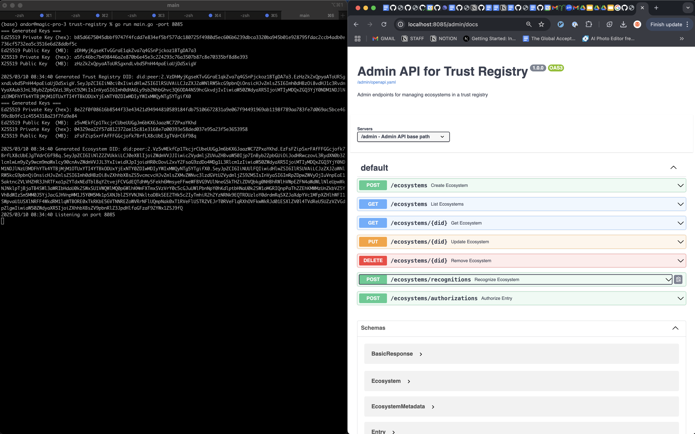
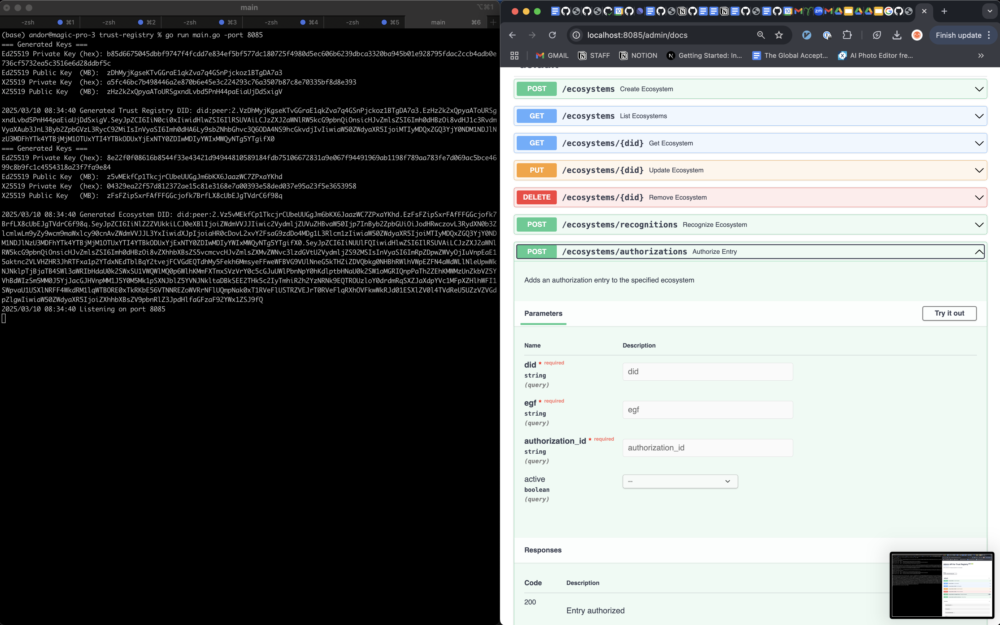
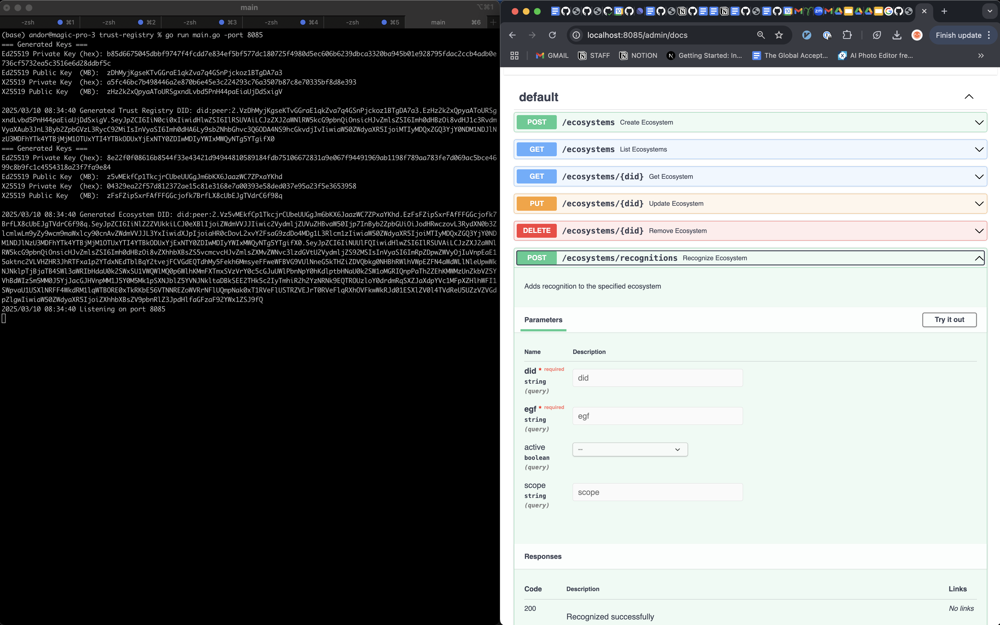
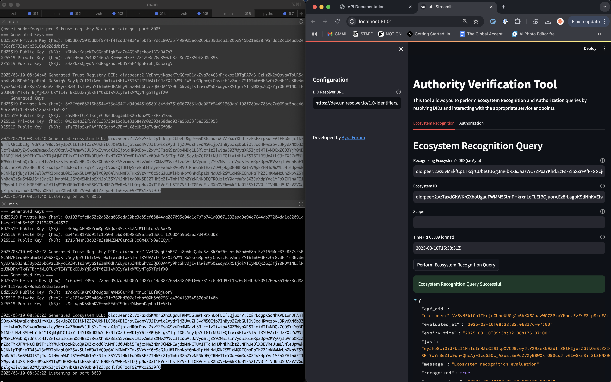
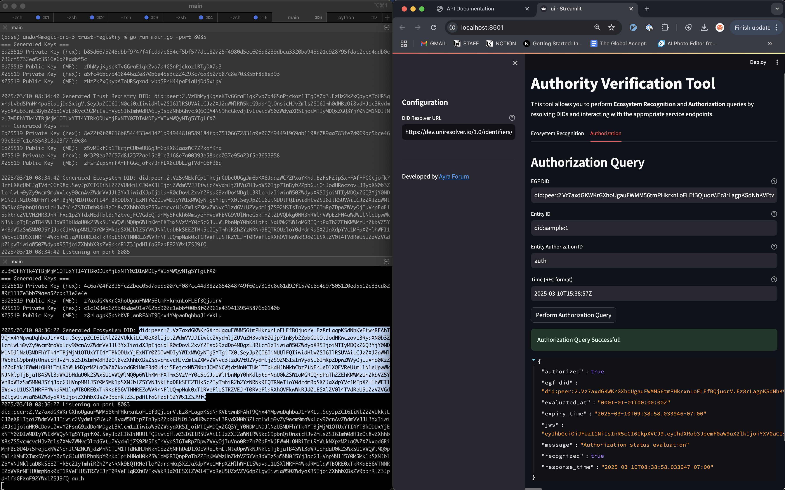

# Ayra Trust Network Playground

This document provides instructions for setting up and testing your own Ayra Trust Network playground environment.

::: note
This is a DRAFT
::: 

## Prerequisites

- Docker and Docker Compose
- Git

## Running with Docker

The easiest way to run the playground is using Docker Compose:

1. Clone the repository:
   ```
   git clone https://github.com/ayraforum/ayra-trust-registry-resources.git
   cd ayra-trust-registry-resources/playground
   ```

2. Start all services using Docker Compose:
   ```
   docker-compose up -d
   ```

3. The following services will be available:
   - Trust Registry 1: http://localhost:8082
   - Trust Registry 2: http://localhost:8083
   - Verifier UI: http://localhost:8501

4. To view logs from any service:
   ```
   docker-compose logs trust-registry-1
   docker-compose logs trust-registry-2
   docker-compose logs verifier
   ```

5. To stop all services:
   ```
   docker-compose down
   ```

## Manual Setup (Alternative to Docker)

If you prefer to run the services without Docker:

### Prerequisites for Manual Setup
- Go programming language (version 1.15+)
- Python (version 3.7+) with pip installed

### Step 1: Set up a Sample Ayra Trust Registry

1. Navigate to the `trust-registry` directory:
   ```
   cd trust-registry
   ```

2. Initialize the Go modules:
   ```
   go mod tidy
   ```

3. Run the Go program:
   ```
   go run main.go --port=8082 --registry-name=TR-1
   ```

4. You will see a DID generated in the console output. Take note of this as it will be referred to as the **Ayra DID**.

### Step 2: Set up a Sample Ecosystem

1. Open a new terminal window

2. Navigate to the `trust-registry` directory:
   ```
   cd trust-registry
   ```

3. Run the Go program on a different port:
   ```
   go run main.go --port=8083 --registry-name=TR-2
   ```

4. This creates a second ecosystem running independently of the Ayra Trust Registry.

5. Note the DID generated for this ecosystem, which will be referred to as the **Sample Ecosystem DID**.



### Step 3: Set up the Verifier

1. Navigate to the verifier directory:
   ```
   cd ../verifier
   ```
2. Install the required Python dependencies:
   ```
   pip install -r requirements.txt
   ```
3. Launch the Streamlit verification interface:
   ```
   streamlit run ui.py
   ```
   This will open a web interface in your default browser at http://localhost:8501

## Working with the Playground

### Step 1: Authorize an Entry in Your Ecosystem

1. Open a web browser and navigate to `http://localhost:8083/admin/docs`
2. Locate and select the `admin/authorize` API endpoint
3. Enter the following required parameters:
   - Authorization Type: [string that defines the type of authorization]
   - EGF Identifier: [identifier for your ecosystem governance framework]
   - Entry ID: [unique identifier for the entity being authorized]
4. Submit the request
5. The entity is now authorized within your sample ecosystem

*Note: In production environments, authorization will follow your specific trust framework and governance processes. This is a simplified sample implementation.*



### Step 2: Establish Recognition Between Ecosystems

1. Navigate to `http://localhost:8082/admin/docs` in your browser
2. Locate and select the `/admin/recognition` API endpoint
3. Enter the following parameters:
   - Target Ecosystem: [Sample Ecosystem DID from Step 2]
   - EGF DID: [Ayra Ecosystem DID from Step 1]
4. Submit the request



*Note: In production, this recognition process will be conducted through the formal Ayra Governance Process.*

### Step 3: Test Verification

#### Testing Ecosystem Recognition

1. In the Streamlit interface (http://localhost:8501), navigate to the "Ecosystem Recognition" tab
2. Complete the form with the following information:
   - Recognizing Ecosystem's DID: [Enter the Ayra DID from Trust Registry 1]
   - Ecosystem ID: [Enter the Sample Ecosystem DID from Trust Registry 2]
3. Click "Perform Ecosystem Recognition Query"
4. The interface will display the recognition status and details of the trust relationship between the two ecosystems



#### Testing Authorization

1. Navigate to the "Authorization" tab in the Streamlit interface
2. Complete the form with the following information:
   - EGF DID: [Enter the Sample Ecosystem DID from Trust Registry 2]
   - Entity ID: [Enter the authorized entity ID from Step 3]
   - Entity Authorization ID: [Enter the authorization type string from Step 3]
3. Click "Perform Authorization Query"
4. The interface will display the authorization status, confirming whether the specified entity is authorized within the ecosystem



## Environment Configuration

Both trust registries can be configured using the following environment variables:

- `PORT`: The port to listen on
- `REGISTRY_NAME`: Name identifier for the registry
- `BASE_URL`: Base URL for service endpoints
- `REGISTRY_PATH`: Path to the registry data file
- `REGISTRY_DATA`: Registry data as inline JSON/YAML (alternative to using a file)

The verifier can be configured with:

- `DEFAULT_DID_RESOLVER_URL`: URL for the DID resolver service
- `TR1_ENDPOINT`: Endpoint for Trust Registry 1
- `TR2_ENDPOINT`: Endpoint for Trust Registry 2

## Exploring DIDs

To better understand the structure of the DIDs created:

1. Visit https://dev.uniresolver.io
2. Enter any of the DIDs generated during this setup
3. Review the DID document structure and properties

## Security Notice

The JWT signatures in response messages should be verified to ensure message
integrity. The current implementation in this playground environment does not
include comprehensive signature verification for demonstration purposes.

## Troubleshooting

- If using Docker and services fail to start, check logs with `docker-compose logs <service-name>`
- Ensure all ports are available (8082, 8083, 8501)
- If running manually, verify that Go and Python dependencies are installed
- Check console output for any error messages that might identify configuration issues

## Next Steps

After successful testing in the playground environment, review the Ayra Trust
Network documentation for production implementation guidelines and best
practices.
